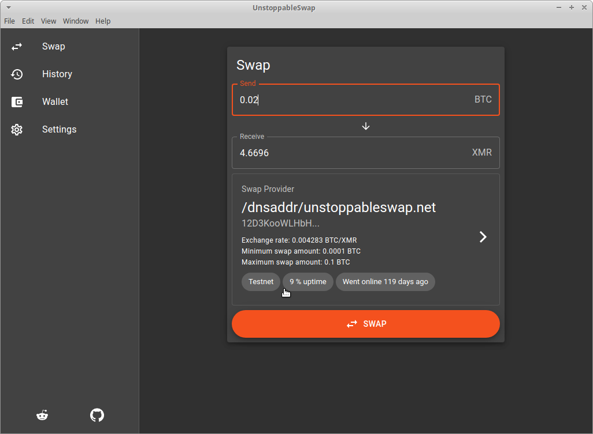
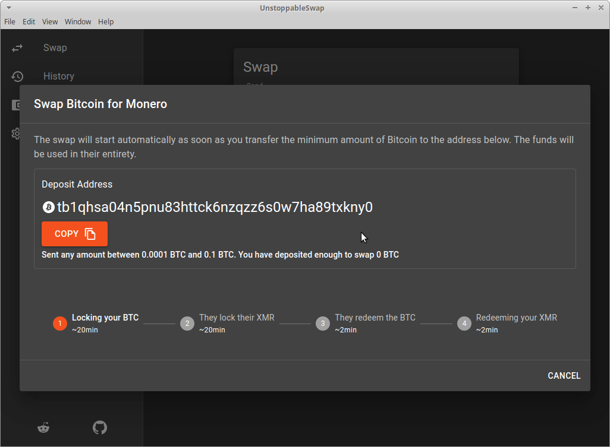
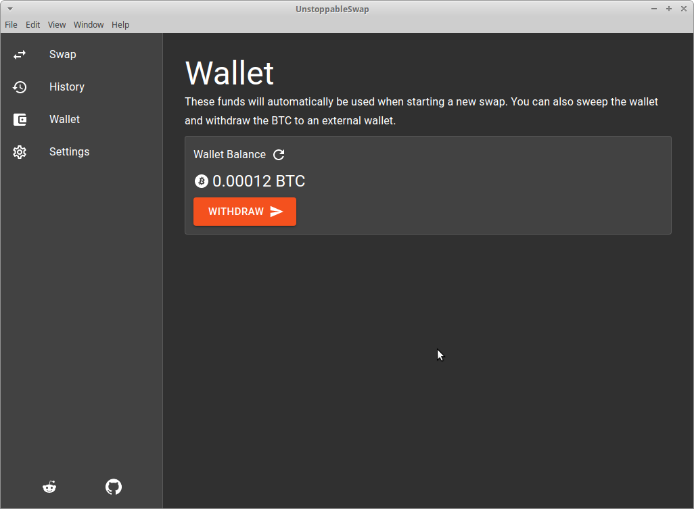
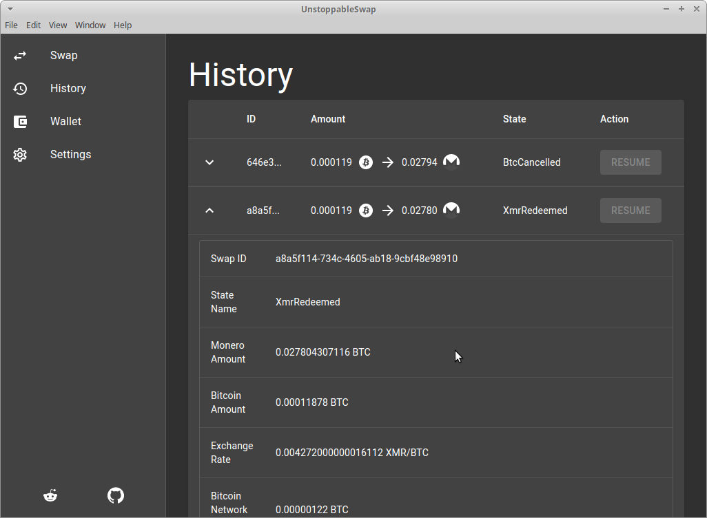

<div align="center">
  
  
  
  
</div>

## Install

First, clone the repo via git and install dependencies:

```bash
git clone --branch main https://github.com/binarybaron/unstoppableswap-gui
cd unstoppableswap-gui
yarn
```

## Starting Development

Start the app in the `TESTNET` environment:

```bash
TESTNET=true yarn start
```

## Packaging for Production

To package apps for the local platform:

```bash
yarn package
```

## Donations

**Donations will ensure the following:**

- 🔨 Long term maintenance of the project
- 🛣 Progress on the roadmap
- 🐛 Quick responses to bug reports and help requests

```
87jS4C7ngk9EHdqFFuxGFgg8AyH63dRUoULshWDybFJaP75UA89qsutG5B1L1QTc4w228nsqsv8EjhL7bz8fB3611Mh98mg
```
