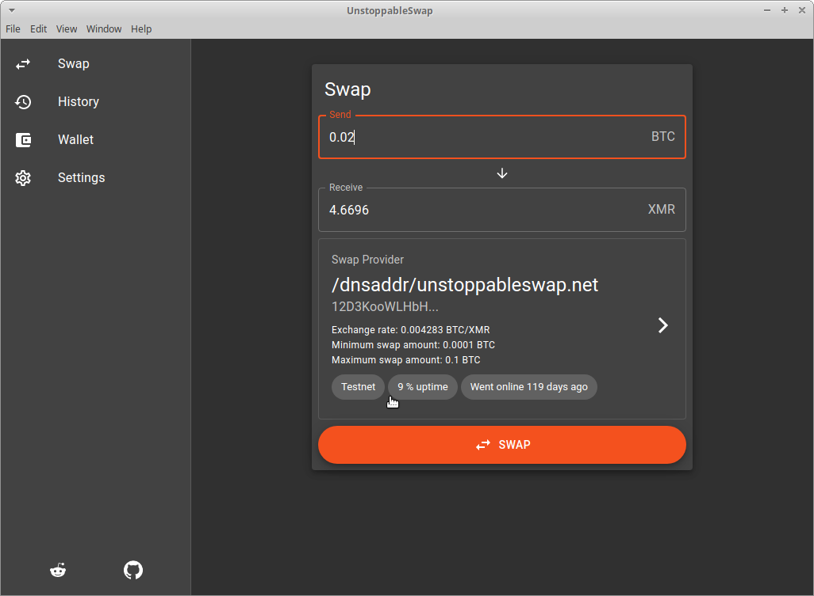
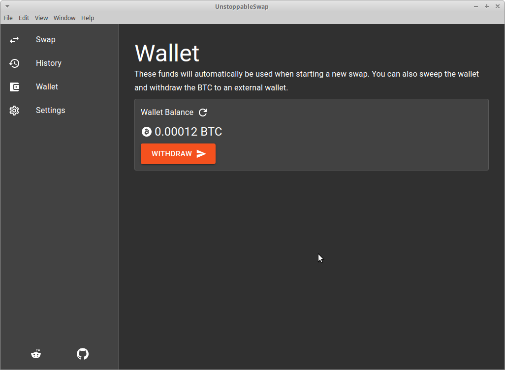
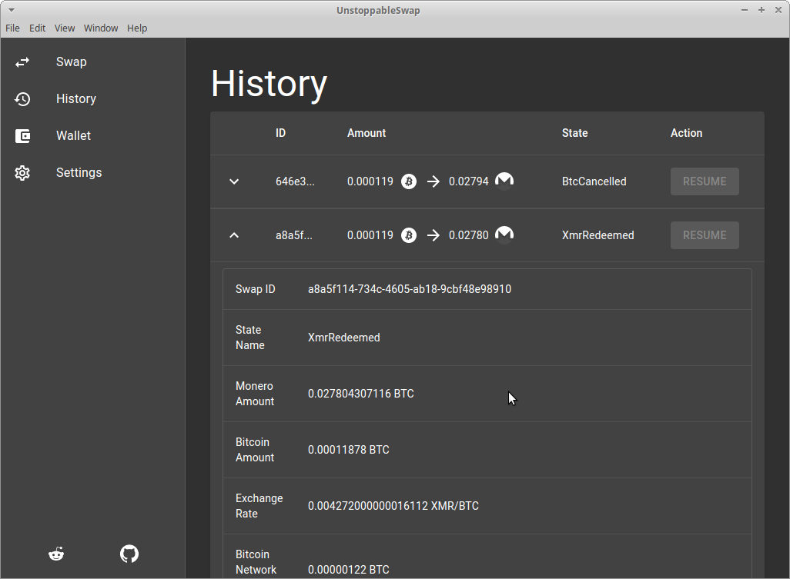

# UnstoppableSwap GUI

Graphical User Interface (GUI) For Trustless Cross-Chain Atomic Swaps for XMR<>BTC

## Installation

Use [yarn](https://yarnpkg.com) to install all dependencies.

```bash
git clone --branch main https://github.com/binarybaron/unstoppableswap-gui
cd unstoppableswap-gui
yarn
```

## Start development environment

```bash
TESTNET=true yarn start
```

## Packaging for Production

To package apps for the local platform:

```bash
yarn package
```

## Overview of architecture

For a better understanding of the different components of the graphical user interface (GUI) and the command line interface (CLI), here is a component diagram showing the components and their corresponding relationships.


## Screenshots

</img> </img> </img> </img>

## Contributing

Pull requests are welcome. For major changes, please open an issue first to discuss what you would like to change.

Please make sure to update tests as appropriate.

## Donations

**Donations will ensure the following:**

- 🔨 Long term maintenance of the project
- 🛣 Progress on the roadmap
- 🐛 Quick responses to bug reports and help requests

```
87jS4C7ngk9EHdqFFuxGFgg8AyH63dRUoULshWDybFJaP75UA89qsutG5B1L1QTc4w228nsqsv8EjhL7bz8fB3611Mh98mg
```

## License

[MIT](https://choosealicense.com/licenses/mit/)
