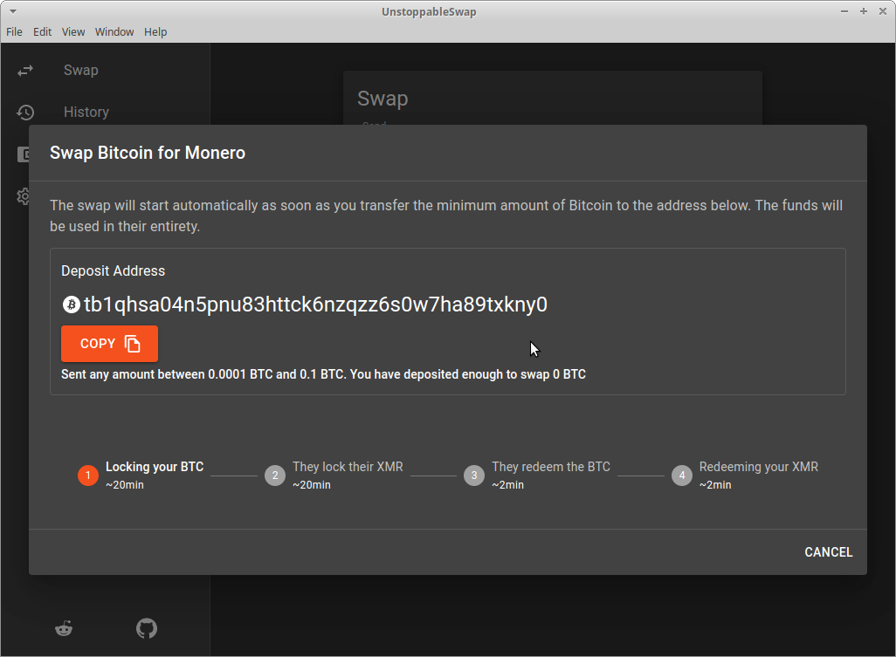

<br/>
<p align="center">
  <a href="https://github.com/UnstoppableSwap/unstoppableswap-gui">
    
  </a>

  <h3 align="center">UnstoppableSwap GUI</h3>

  <p align="center">
    Graphical User Interface (GUI) For Trustless Cross-Chain XMR<>BTC Atomic Swaps 
    <br/>
    <br/>
    <a href="https://github.com/UnstoppableSwap/unstoppableswap-gui">View Demo</a>
    .
    <a href="https://github.com/UnstoppableSwap/unstoppableswap-gui/issues">Report Bug</a>
    .
    <a href="https://github.com/UnstoppableSwap/unstoppableswap-gui/issues">Request Feature</a>
  </p>
</p>

    

## Table Of Contents

* [About the Project](#about-the-project)
* [Built With](#built-with)
* [Getting Started](#getting-started)
  * [Prerequisites](#prerequisites)
  * [Installation](#installation)
* [Roadmap](#roadmap)
* [Contributing](#contributing)
* [License](#license)
* [Authors](#authors)
* [Acknowledgements](#acknowledgements)

## About The Project



Atomic swaps between BTC and XMR have been one of the most discussed and anticipated developments in the field for quite some time. 

While Farcaster is still working on the implementation of their protocol, the COMIT team has already delivered an MVP. Trustless cross-chain swaps are becoming a tangible reality.
However, for atomic swaps to gain widespread and adopted, the user experience needs to be drastically improved. People shouldn't have to manually type commands into a terminal or understand the protocol at a technical level to participate. That's the problem this project aims to solve.

*Make atomic swaps accessible to all!*


## Built With

- [COMIT Swap CLI](https://github.com/comit-network/xmr-btc-swap)
- [Electron](https://github.com/comit-network/xmr-btc-swap)
- [React](https://reactjs.org)
- [Redux](https://redux.js.org)
- [Material UI](https://mui.com)

## Getting Started

To get a local copy up and running follow these simple steps.

### Prerequisites

Before proceeding you should install the following:
- [node (v16)](https://nodejs.org/en/download/)
- [npm](https://docs.npmjs.com/downloading-and-installing-node-js-and-npm) (probably bundled with your installation) 

### Installation

Clone the repository, install all dependencies using npm and start the GUI on testnet.

```bash
git clone --branch main https://github.com/binarybaron/unstoppableswap-gui
cd unstoppableswap-gui
npm install
```

```bash
TESTNET=true npm start
```

## Roadmap

See the [open issues](https://github.com/UnstoppableSwap/unstoppableswap-gui/issues) for a list of proposed features (and known issues).

## Contributing

Contributions are what make the open source community such an amazing place to be learn, inspire, and create. Any contributions you make are **greatly appreciated**.
* If you have suggestions for adding or removing projects, feel free to [open an issue](https://github.com/UnstoppableSwap/unstoppableswap-gui/issues/new) to discuss it, or directly create a pull request after you edit the *README.md* file with necessary changes.
* Please make sure you check your spelling and grammar.
* Create individual PR for each suggestion.

### Creating A Pull Request

1. Fork the Project
2. Create your Feature Branch (`git checkout -b feature/AmazingFeature`)
3. Commit your Changes (`git commit -m 'Add some AmazingFeature'`)
4. Push to the Branch (`git push origin feature/AmazingFeature`)
5. Open a Pull Request

## License

Distributed under the MIT License. See [LICENSE](https://github.com/UnstoppableSwap/unstoppableswap-gui/blob/main/LICENSE.md) for more information.

## Acknowledgements

* [thomaseizinger (Thomas Eizinger)](https://github.com/thomaseizinger)
* [da-kami (Daniel Karzel)](https://github.com/da-kami)
* [rishflab](https://github.com/rishflab)
* [bonomat (Philipp Hoenisch)](https://github.com/bonomat)
* [luckysori (Lucas Soriano)](https://github.com/luckysori)
* [D4nte (Franck R.)](https://github.com/D4nte)

